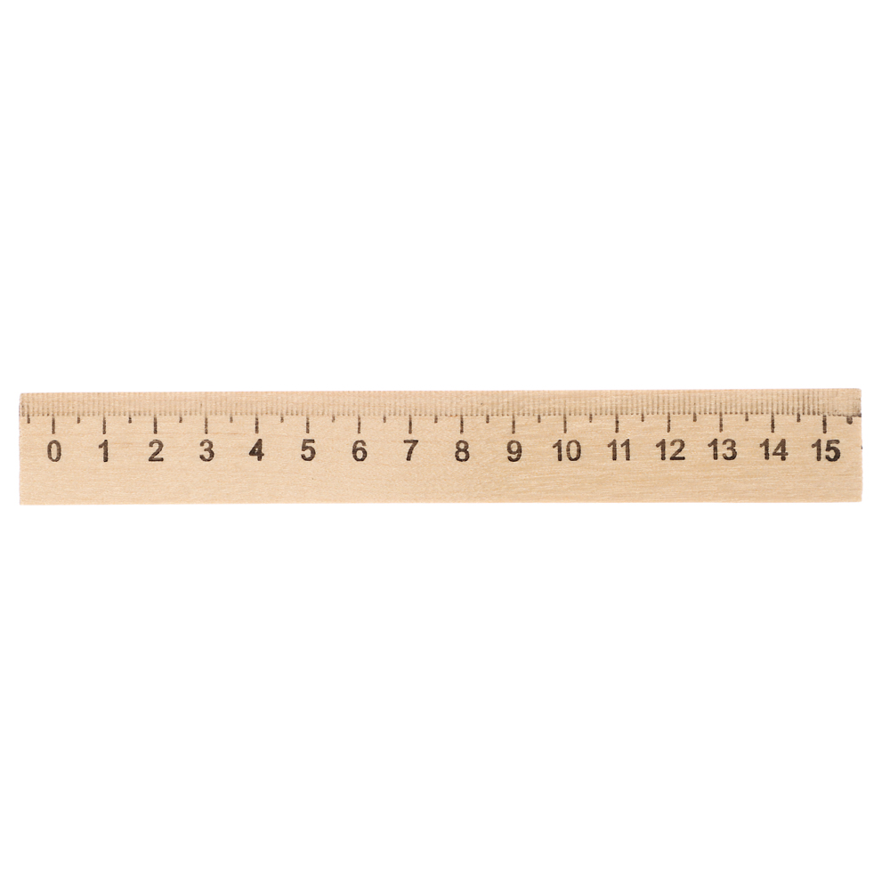
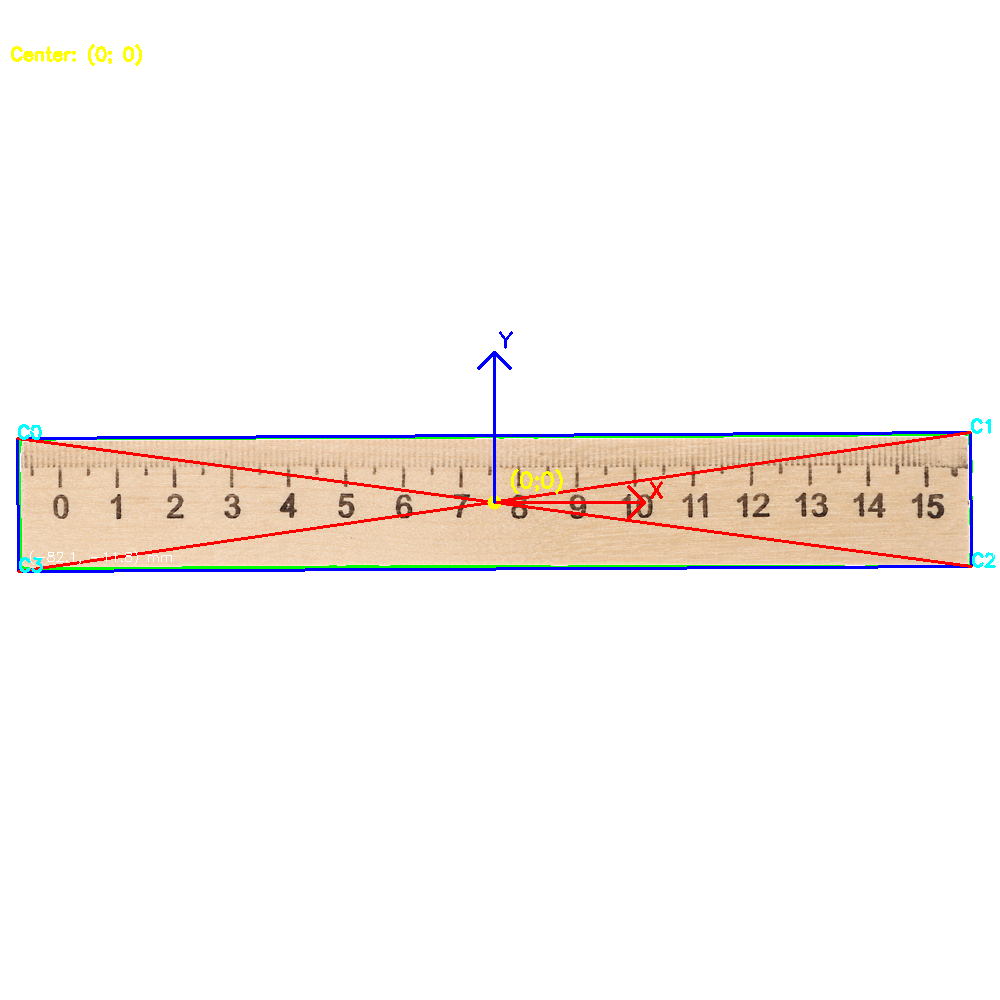
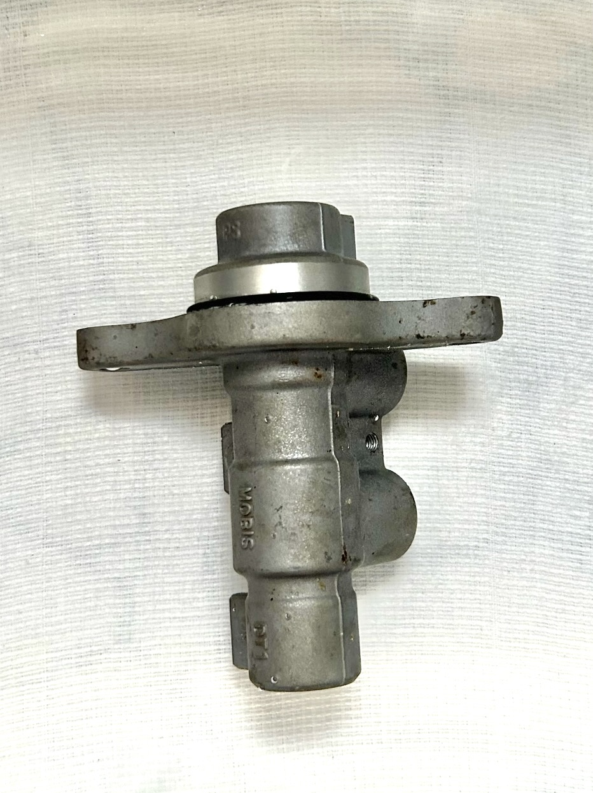
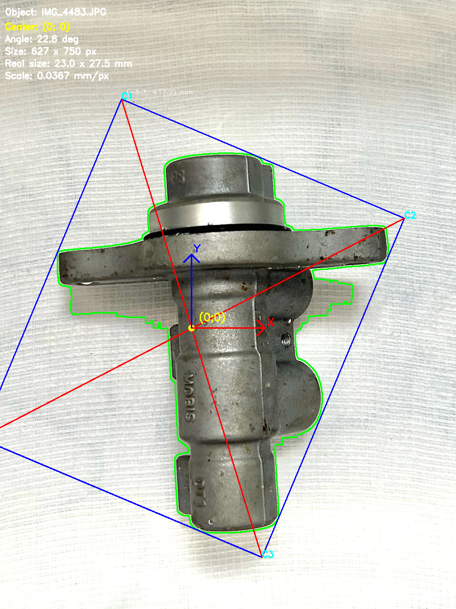

# Определение координат объекта на рабочей области станка с использованием нейросетей
## Состав команды
### [Стрельников Максим](https://github.com/mansvlx)
### [Титов Алексей](https://github.com/ALLgeg)
### [Коровина Анна](https://github.com/Obozhglas)
### [Котомчин Тимофей](https://github.com/KOTOMKAFIRST)

# Описание работы кода 
Код вписывает деталь в прямоугольник, с помощью диагоналей определяет центр, далее измеряет размеры детали. 
# Результаты работы кода 
В качестве проверки корректной работы нашего кода мы взяли линейку размером чуть больше 160 мм, и как мы видим по результату измерений из приложенных файлов - код работает корректно.
результаты обработки некоторых изделий представлены ниже:

 

